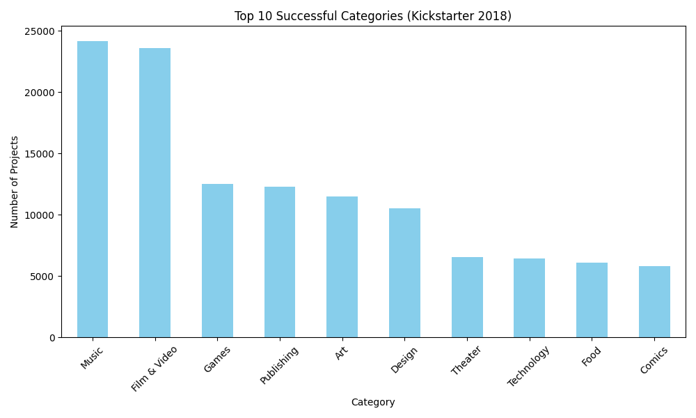
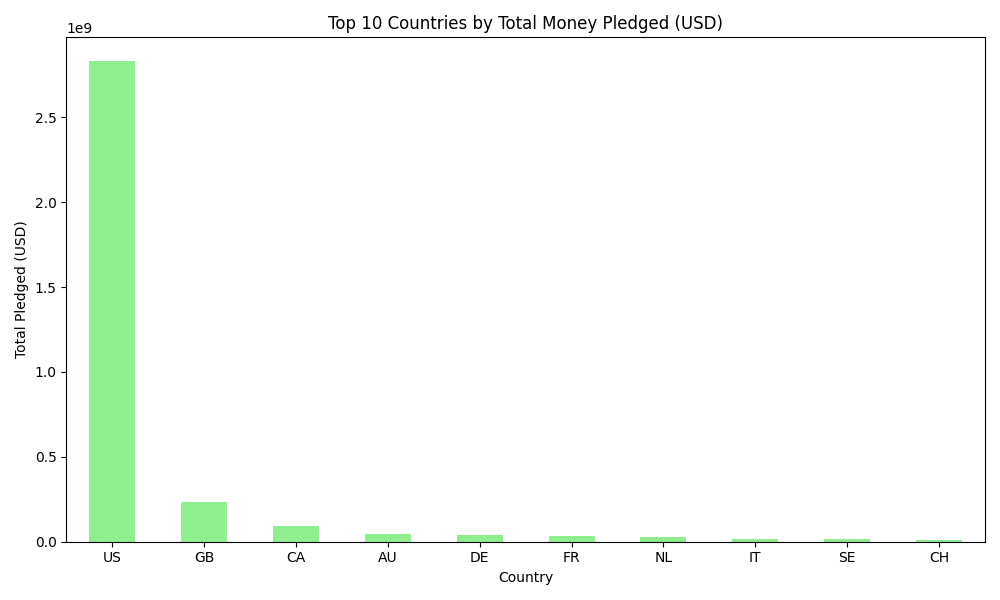

# Kickstarter Data Analysis Project 
**Developed by Alan Barahona**

## Project Overview
This project performs a comprehensive analysis of the **Kickstarter 2018 dataset** (over 300,000 projects). Using **Python** and **SQL**, I extracted key insights about project success rates and global funding trends.

## Features
* **Data Ingestion**: Professional migration of 56MB CSV data to a structured **SQLite** database.
* **SQL Querying**: Advanced analysis of categories, countries, and project states.
* **Interactive Visualization**: Generation of dynamic bar charts to represent data findings.

## Tech Stack 
* **Language**: Python 3.13
* **Libraries**: 
    * `Pandas`: For high-performance data manipulation.
    * `Matplotlib`: For interactive data visualization.
    * `SQLite3`: For relational database management.

## Key Insights 
1. **Top Categories**: Categories like *Music* and *Film & Video* show the highest volume of successful projects.
2. **Global Funding**: The *US* leads in total money pledged, followed by the *UK* and *Canada*.

## How to Run
1. **Download the dataset**: This project uses the "Kickstarter Projects" dataset from Kaggle.
   [Click here to download the CSV file](https://www.kaggle.com/datasets/kemical/kickstarter-projects?select=ks-projects-201801.csv)

2. **Prepare the files**: Place the `ks-projects-201801.csv` file in the root folder of this project (same folder as the scripts).

3. **Initialize the Database**: Run the following command to create the SQLite database from the CSV data:
   ```bash
   python database_setup.py

4. **Run the Analysis**: Once the `kickstarter.db` file is generated, run the analysis script to view statistics and interactive charts:
   ```bash
   python data_analysis.py

##  Project Insights & Visualizations

After processing the data, these are the main findings from the Kickstarter 2018 dataset:

### 1. Most Successful Categories
The following chart shows the Top 10 categories with the highest number of successfully funded projects. **Music** and **Film & Video** are leading the platform in terms of project volume.



### 2. Global Funding by Country
When looking at the total money pledged (USD), the **United States (US)** significantly outpaces all other countries, showing its dominance as the primary market for crowdfunding.



---
---
*This project was developed as part of my professional portfolio for Software Development and Data Analysis.*
